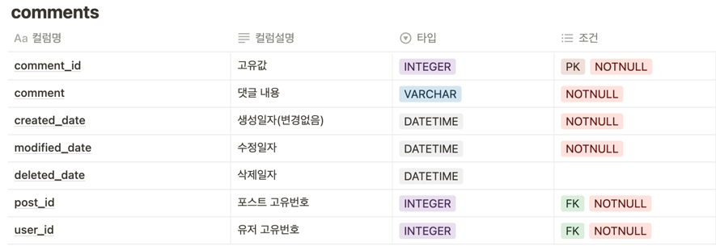
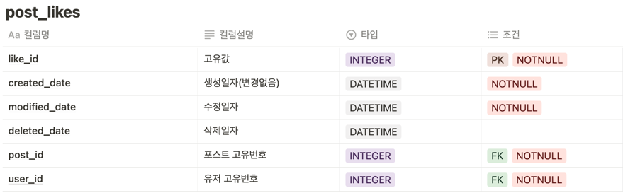
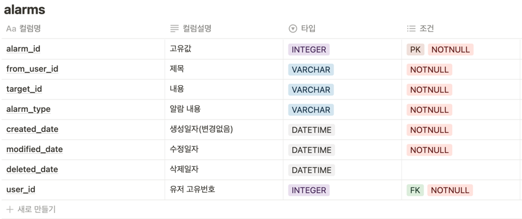

# MutsaSNS

url: http://ec2-43-200-70-107.ap-northeast-2.compute.amazonaws.com:8080/swagger-ui/

### 참고자료
hibernate : https://docs.jboss.org/hibernate/orm/5.4/userguide/html_single/Hibernate_User_Guide.html

### 체크리스트
✅ 회원가입 <br>
✅ Swagger <br>
✅ AWS EC2에 Docker 배포 <br>
✅ Gitlab CI & Crontab CD <br>
✅ 로그인 <br>
✅ 포스트 작성, 수정, 삭제, 리스트 <br>
✅ ADMIN 회원으로 등급업하는 기능 <br>
✅ ADMIN 회원이 일반 회원을 ADMIN으로 승격시키는 기능 <br>
✅ ADMIN 회원이 로그인 시 자신이 쓴 글이 아닌 글과 댓글에 수정, 삭제를 할 수 있는 기능 <br>
✅ 댓글 <br>
✅ 좋아요 <br>
✅ 마이피드 <br>
✅ 알림 <br>
☑️ 화면 UI 개발(차후 개발 예정) <br>

### [접근 방법 및 고민했던 부분]
- db에 관한 설계를 고민해보았습니다.
- CI/CD 를 위해 많은 자료들을 공부하였고, crontab과 gitlab 파이프라인을 활용했습니다.
- 스웨거를 통해 화면 구성 없이 기능 API 문서를 자동화하여 볼 수 있게 했습니다.
- 인증/인가를 위해 토큰 기반 인증 Bearer Authentication 중 jwt을 사용했습니다.
- hibernate 원서와 jpa에서 사용하는 애노테이션을 보며 디폴트 값과 사용방법을 공부하며 적용했습니다.
- 엔티티 값을 setter로 변경하는 것을 지양했습니다.
- 기능 단위의 테스트로 컨트롤러 테스트와 서비스 테스트를 진행했습니다.
- 로깅을 적용할 시점을 런타임 시점에 적용해야 하는 것이 최선일까?
  - 컴파일 시점 로딩
  - 클래스 로딩 시점 로딩
  - 런타임 시점(사용한 방법)
    - 런타인 시점에 프록시 방식으로 스프링 AOP를 적용하다보니, 조인 포인트가 메서드 실행으로 제한되었다.
    - 그로 인해 생성자, static 메서드 그리고 필드 값은 로깅이 불가능하다.
- toEntity() 메서드가 다른 것에 의존해도 되는 것인가?
  - toEntity메서드의 역할은 dto 객체를 entity로 만드는 역할인데, CommentCreateRequestDto에서 toEntity는 유저 엔티티와 포스트 엔티티에 의존하게 된다.
- 알람 기능을 만들 때, 결합도에 관한 문제
  - 알람 기능을 만들고 적용하려고 할 때, PostService, commentService, postLikeService, userService 모두 alarmRepository에 의존하게 된다.
  - 댓글이 작성될 때 마다 알람을 전송한다는 것 댓글에 관한 비지니스 로직으로 보기는 힘들어보이고, commentService가 가져야 하는 책임인지도 의문이 든다.
- jpql을 공부하는 시간이 되었습니다.

### [아쉬운 점]
- 테스트에 대한 기본지식 부족과 mock에 대한 지식 부족으로 인해 기능 테스트시간이 기능구현시간보다 적어도 3배이상 걸렸습니다.
- Thymeleaf 를 복습할 겸 화면 UI를 만들고자 했지만, 못만들어서 아쉽습니다.

### 관리자 아이디
```json
{
  "userName":"jin",
  "password":"jin"
} 
```
<br>
<br>

## 📔  Architecture(아키텍처) - Layered Architecture 구조


## DB설계

### users


### posts


### comments


### postLikes


### alarms


## ERD


## EndPoint
### 회원가입
`POST /api/v1/users/join`

**request**
```json
{
  "password": "string",
  "userName": "string"
}
```

**response**
```json
{
"resultCode": "SUCCESS",
"result":{
    "userId": int,
    "userName": "string"
    }
}
```

### 로그인
`POST /api/v1/users/login`

**request**
```json
{
  "userName": "string",
  "password": "string"
}
```

**response**
```json
{
  "resultCode": "SUCCESS",
  "result":{
    "jwt": "string"
  }
}
```

### 역할변경
`POST /api/v1/users/{userId}/role/change`

**response**
```json
{
"resultCode": "SUCCESS",
    "result":{
        "role": "string"
    }
}
```

### 알람 조회
`GET /api/v1/alarms`
```json
{
  "result": {
    "content": [
      {
        "alarmType": "string",
        "createdAt": "2023-01-10T05:12:12.013Z",
        "id": int,
        "targetId": int,
        "text": "string",
        "userId": int
      }
    ],
    "empty": boolean,
    "first": boolean,
    "last": boolean,
    "number": int,
    "numberOfElements": int,
    "pageable": {
      "offset": int,
      "pageNumber": int,
      "pageSize": int,
      "paged": boolean,
      "sort": {
        "empty": boolean,
        "sorted": boolean,
        "unsorted": boolean
      },
      "unpaged": boolean
    },
    "size": int,
    "sort": {
      "empty": boolean,
      "sorted": boolean,
      "unsorted": boolean
    },
    "totalElements": int,
    "totalPages": int
  },
  "resultCode": "string"
}
```

### 포스트 등록
`POST /api/v1/posts`

**request**
```json
{
  "title": "string",
  "body": "string"
}
```

**response**
```json
"resultCode":"SUCCESS",
  "result":{
    "postId": int
    "message": "포스트 등록 완료",
    }
}
```


### 포스트 단건 조회
`GET /api/v1/posts/{postId}`

**response**
```json
{
  "id": int,
  "title": "string",
  "body": "string",
  "userName": "string",
  "createdAt": "yyyy-mm-dd hh:mm:ss",
  "lastModifiedAt": "yyyy-mm-dd hh:mm:ss"
}
```


### 포스트 리스트
`GET /api/v1/posts`

**response**
```json
{
    "resultCode": "SUCCESS",
    "result": {
        "content": [],
        "pageable": pageable,
        "last": boolean,
        "totalPages": int,
        "totalElements": int,
        "size": int,
        "number": int,
        "sort": {
            "empty": boolean,
            "sorted": boolean,
            "unsorted": boolean
        },
        "first": boolean,
        "numberOfElements": int,
        "empty": boolean
    }
}
```


### 포스트 수정
`PUT /api/v1/posts/{postId}`

**request**
```json
{
  "title":"string",
  "body":"string"
}
```

**response**
```json
{"resultCode":"SUCCESS",
  "result":{
    "postId": int
    "message": "포스트 수정 완료",
    }
}
```


### 포스트 삭제
`DELETE /api/v1/posts/{postId}`

**response**
```json
{"resultCode":"SUCCESS",
  "result":{
    "message": "포스트 삭제 완료",
    "postId": int
    }
}
```

### 댓글 등록
`POST /api/v1/posts/{postId}/comments`
**request**
```json
{
  "comment": "string"
}
```
**response**
```json
{
  "result": {
    "comment": "string",
    "createdAt": "2023-01-10T04:41:42.500Z",
    "id": int
    "postId": int
    "userName": "string"
  },
  "resultCode": "string"
}
```

### 댓글 리스트
`GET /api/v1/posts/{postId}/comments`

**response**
```json
{
  "result": {
    "content": [
      {
        "comment": "string",
        "createdAt": "2023-01-10T04:43:45.078Z",
        "id": int,
        "postId": int,
        "userName": "string"
      }
    ],
    "empty": boolean,
    "first": boolean,
    "last": boolean,
    "number": int,
    "numberOfElements": int,
    "pageable": {
      "offset": int,
      "pageNumber": int,
      "pageSize": int,
      "paged": boolean,
      "sort": {
        "empty": boolean,
        "sorted": boolean,
        "unsorted": boolean
      },
      "unpaged": boolean
    },
    "size": int,
    "sort": {
      "empty": boolean,
      "sorted": boolean,
      "unsorted": boolean
    },
    "totalElements": boolean,
    "totalPages": boolean
  },
  "resultCode": "string"
}
```

### 댓글 수정
`PUT /api/v1/posts/{postId}/comments/{commentsId}`

**request**
```json
{
  "comment" : "string"
}
```

**response**
```json
{
  "result": {
    "comment": "string",
    "createdAt": "yyyy-MM-dd HH:mm:ss",
    "id": int,
    "lastModifiedAt": "yyyy-MM-dd HH:mm:ss",
    "postId": int,
    "userName": "string"
  },
  "resultCode": "string"
}
```

### 댓글 삭제
`DELETE /api/v1/posts/{postId}/comments/{commentId}`

**response**
```json
{
  "result": {
    "id": int,
    "message": "string"
  },
  "resultCode": "string"
}
```

### 좋아요 추가
`POST /api/v1/posts/{postId}/likes`

**response**
```json
{
  "result": "string",
  "resultCode": "string"
}
```

### 좋아요 개수 조회
`GET /api/v1/posts/{postId}/likes`

**response**
```json
{
  "result": int,
  "resultCode": "string"
}
```

### 좋아요 취소
`DELETE /api/v1/posts/{postId}/likes`
```json
{
  "result": "string",
  "resultCode": "string"
}
```

### 좋아요 추가 및 삭제(누르면 추가, 다시누르면 삭제)
`POST /api/v1/posts/{postId}/likes2`
```json
{
  "result": "string",
  "resultCode": "string"
}
```


