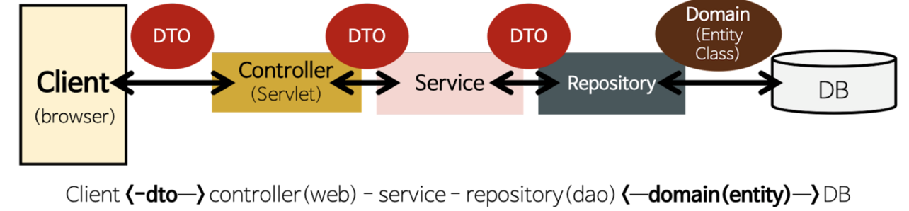
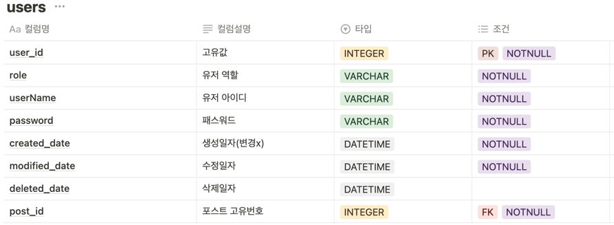
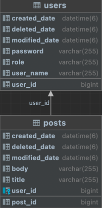

# MutsaSNS

url: http://ec2-43-200-70-107.ap-northeast-2.compute.amazonaws.com:8080/swagger-ui/

### 참고자료
hibernate : https://docs.jboss.org/hibernate/orm/5.4/userguide/html_single/Hibernate_User_Guide.html

### 체크리스트
✅ 회원가입 <br>
✅ Swagger <br>
✅ AWS EC2에 Docker 배포 <br>
✅ Gitlab CI & Crontab CD <br>
✅ 로그인 <br>
✅ 포스트 작성, 수정, 삭제, 리스트 <br>
✅ ADMIN 회원으로 등급업하는 기능 <br>
✅ ADMIN 회원이 일반 회원을 ADMIN으로 승격시키는 기능 <br>
✅ ADMIN 회원이 로그인 시 자신이 쓴 글이 아닌 글과 댓글에 수정, 삭제를 할 수 있는 기능 <br>
☑️ 화면 UI 개발 <br>

### [접근 방법]
- db에 관한 설계를 고민해보았습니다.
- CI/CD 를 위해 많은 자료들을 공부하였고, crontab과 gitlab 파이프라인을 활용했습니다.
- 스웨거를 통해 화면 구성 없이 기능 API 문서를 자동화하여 볼 수 있게 했습니다.
- 인증/인가를 위해 토큰 기반 인증 Bearer Authentication 중 jwt을 사용했습니다.
- hibernate 원서와 jpa에서 사용하는 애노테이션을 보며 디폴트 값과 사용방법을 공부하며 적용했습니다.
- 엔티티 값을 직접 변경하는 것을 지양했습니다.
- 기능 단위의 테스트와 컨트롤러 테스트에서 통합테스트를 진행했습니다.

### [아쉬운 점]
- 테스트에 대한 기본지식 부족과 mock에 대한 지식 부족으로 인해 기능 테스트시간이 기능구현시간보다 적어도 3배이상 걸렸습니다.
- Thymeleaf 를 복습할 겸 화면 UI를 만들고자 했지만, 못만들어서 아쉽습니다.
- 
### 관리자 아이디
```json
{
  "userName":"jin",
  "password":"jin"
} 
```
<br>
<br>

## 📔  Architecture(아키텍처) - Layered Architecture 구조


## DB설계

### users


### posts


## ERD


## EndPoint
### 회원가입
`POST /api/v1/users/join`

**request**
```json
{
  "password": "string",
  "userName": "string"
}
```

**response**
```json
{
"resultCode": "SUCCESS",
"result":{
    "userId": int,
    "userName": "string"
    }
}
```

### 로그인
`POST /api/v1/users/login`

**request**
```json
{
  "userName": "string",
  "password": "string"
}
```

**response**
```json
{
  "resultCode": "SUCCESS",
  "result":{
    "jwt": "string"
  }
}
```

### 역할변경
`POST /api/v1/users/{userId}/role/change`

**response**
```json
{
"resultCode": "SUCCESS",
    "result":{
        "role": "string"
    }
}
```

### 포스트 등록
`POST /api/v1/posts`

**request**
```json
{
  "title": "string",
  "body": "string"
}
```

**response**
```json
"resultCode":"SUCCESS",
  "result":{
    "postId": int
    "message": "포스트 등록 완료",
    }
}
```


### 포스트 단건 조회
`GET /api/v1/posts/{postId}`

**response**
```json
{
  "id": int,
  "title": "string",
  "body": "string",
  "userName": "string",
  "createdAt": "yyyy-mm-dd hh:mm:ss",
  "lastModifiedAt": "yyyy-mm-dd hh:mm:ss"
}
```


### 포스트 리스트
`GET /api/v1/posts`

**response**
```json
{
    "resultCode": "SUCCESS",
    "result": {
        "content": [],
        "pageable": pageable,
        "last": boolean,
        "totalPages": int,
        "totalElements": int,
        "size": int,
        "number": int,
        "sort": {
            "empty": boolean,
            "sorted": boolean,
            "unsorted": boolean
        },
        "first": boolean,
        "numberOfElements": int,
        "empty": boolean
    }
}
```


### 포스트 수정
`PUT /api/v1/posts/{postId}`

**request**
```json
{
  "title":"string",
  "body":"string"
}
```

**response**
```json
{"resultCode":"SUCCESS",
  "result":{
    "postId": int
    "message": "포스트 수정 완료",
    }
}
```


### 포스트 삭제
`DELETE /api/v1/posts/{postId}`

**response**
```json
{"resultCode":"SUCCESS",
  "result":{
    "message": "포스트 삭제 완료",
    "postId": int
    }
}
```


